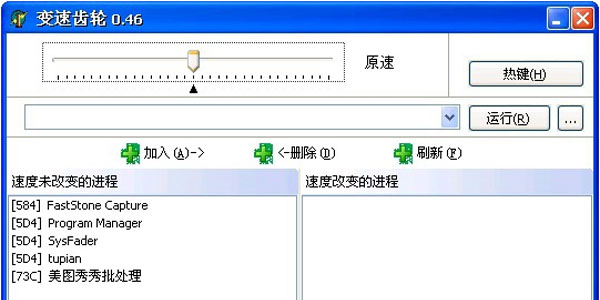

# 进程的地址空间

## Overview

复习

- 操作系统：加载第一个 `init` 程序，随后变为 “异常处理程序”
- `init`: fork, execve, exit 和其他系统调用创造整个操作系统世界

------

本次课回答的问题

- **Q**: 进程的地址空间是如何创建、如何更改的？

------

本次课主要内容

- 进程的地址空间和管理 (mmap)

## 一、进程的地址空间

### 1、进程的地址空间

`char *p` 可以和 `intptr_t` 互相转换

- 可以指向 “任何地方”
- 合法的地址 (可读或可写)
    - 代码 (`main`, `%rip` 会从此处取出待执行的指令)，只读
    - 数据 (`static int x`)，读写
    - 堆栈 (`int y`)，读写
    - 运行时分配的内存 (???)，读写
    - 动态链接库 (???)
- 非法的地址
    - `NULL`，导致 segmentation fault

------

它们停留在概念中，但实际呢？

```c
#include <stdio.h>

int main() {
  unsigned *p;
  p = (void *)main;

  printf("%x\n", *p);
}
```


```bash
$ gcc a.c && ./a.out
fa1e0ff3

$ objdump -d a.out
...
0000000000001149 <main>:
    1149:	f3 0f 1e fa          	endbr64 
    114d:	55                   	push   %rbp
    114e:	48 89 e5             	mov    %rsp,%rbp
...
```

指针指向不合法的地址，Segmentation fault

```c
#include <stdio.h>

int main() {
  unsigned *p;
  //p = (void *)main;
  p = (void *)(0x123123123);
  printf("%x\n", *p);
}

// Segmentation fault
```

### 2、查看进程的地址空间

pmap (1) - report memory of a process

- Claim: pmap 是通过访问 procfs (`/proc/`) 实现的
- 如何验证这一点？

------

查看进程的地址空间

- [minimal.S](http://jyywiki.cn/pages/OS/2022/demos/minimal.S) (静态链接)
- 最小的 Hello World (静态/动态链接)
    - 进程的地址空间：**若干连续的 “段”**
    - “段” 的内存可以访问
    - 不在段内/违反权限的内存访问 触发 SIGSEGV
        - gdb 可以 “越权访问”，但不能访问 “不存在” 的地址

```assembly
#include <sys/syscall.h>

.globl _start
_start:
  movq $SYS_write, %rax   # write(
  movq $1,         %rdi   #   fd=1,
  movq $st,        %rsi   #   buf=st,
  movq $(ed - st), %rdx   #   count=ed-st
  syscall                 # );

  movq $SYS_exit,  %rax   # exit(
  movq $1,         %rdi   #   status=1
  syscall                 # );

st:
  .ascii "\033[01;31mHello, OS World\033[0m\n"
ed:
```

`pmap` 查看进程所有的地址空间

```bash
$ gcc -c a.S && ld a.o && ./a.out
Hello, OS World

$ strace ./a.out
execve("./a.out", ["./a.out"], 0x7ffdea564a90 /* 22 vars */) = 0
write(1, "\33[01;31mHello, OS World\33[0m\n", 28Hello, OS World
) = 28
exit(1)                                 = ?
+++ exited with 1 +++

$ gdb a.out
(gdb) starti
Starting program: /root/demo/a.out 

Program stopped.
0x0000000000401000 in _start ()
(gdb) info inferiors
  Num  Description       Executable        
* 1    process 651134    /root/demo/a.out

$ pmap 651134
651134:   /root/demo/a.out
0000000000400000      8K r-x-- a.out
00007ffff7ffb000     12K r----   [ anon ]
00007ffff7ffe000      4K r-x--   [ anon ]
00007ffffffde000    132K rwx--   [ stack ]
ffffffffff600000      4K --x--   [ anon ]
 total              160K
```

`pmap` 的结果，由很多很多段组成

每个段有起始地址 和 大小

如：a.out 从 400000 开始有一段连续的 8K 的内存，这段内存可读可执行，这里只有代码

我们执行的第一条指令 _start 在 401000

系统里还分配了些其他空间，anon、stack

stack：操作系统在执行 execve 的时候会有些参数或环境变量，按照约定放在 stack 里面，132K，rwx

### 3、操作系统提供查看进程地址空间的机制

RTFM: `/proc/[pid]/maps` (man 5 proc)

- 进程地址空间中的每一段
    - 地址 (范围) 和权限 (rwxsp)
    - 对应的文件: offset, dev, inode, pathname
        - TFM 里有更详细的解释
- 和 readelf (-l) 里的信息互相验证
    - 课后习题：定义一些代码/数据，观察变化

```bash
$ man 5 proc

address           perms offset   dev   inode      pathname
00400000-00401000 r--p  00000000 fd:00 525733     a.out
00401000-00495000 r-xp  00001000 fd:00 525733     a.out
00495000-004bc000 r--p  00095000 fd:00 525733     a.out
004bd000-004c3000 rw-p  000bc000 fd:00 525733     a.out
004c3000-004c4000 rw-p  00000000 00:00 0          [heap]
```

---

```bash
$ strace pmap 651134 |& vim -

196 openat(AT_FDCWD, "/proc/651134/maps", O_RDONLY) = 3
197 fstat(3, {st_mode=S_IFREG|0444, st_size=0, ...}) = 0
198 read(3, "00400000-00402000 r-xp 00000000 "..., 1024) = 415
199 read(3, "", 1024)                       = 0
200 close(3)                                = 0
201 write(1, "651134:   /root/demo/a.out\n00000"..., 258651134:   /root/demo/a.out
202 0000000000400000      8K r-x-- a.out
203 00007ffff7ffb000     12K r----   [ anon ]
204 00007ffff7ffe000      4K r-x--   [ anon ]
205 00007ffffffde000    132K rwx--   [ stack ]
206 ffffffffff600000      4K --x--   [ anon ]
207  total              160K

$ cat /proc/651134/maps
00400000-00402000 r-xp 00000000 fc:01 1450381                            /root/demo/a.out
7ffff7ffb000-7ffff7ffe000 r--p 00000000 00:00 0                          [vvar]
7ffff7ffe000-7ffff7fff000 r-xp 00000000 00:00 0                          [vdso]
7ffffffde000-7ffffffff000 rwxp 00000000 00:00 0                          [stack]
ffffffffff600000-ffffffffff601000 --xp 00000000 00:00 0                  [vsyscall]
```

`/proc/651134/maps` 有进程的编号、命令行、从属关系、地址空间的详细信息（比 pmap 更详细）

如果指针指向 rwxp 就可以写入，如果指向 r-xp 就会 Segmentation fault

---

```c
int main() {}
```

静态链接的可执行文件，地址空间是什么样的？

要比上个汇编例子多一些可执行文件 /root/demo/a.out，是因为有些段放的是变量、参数是可写的，也有代码段是不可写的

```bash
$ gcc -static a.c
$ file a.out
a.out: ELF 64-bit LSB executable, x86-64, version 1 (GNU/Linux), statically linked, BuildID[sha1]=8cb7e14e1f24c623eaba46341b2ba92f11cde4cf, for GNU/Linux 3.2.0, not stripped

$ gdb a.out
(gdb) starti
(gdb) info i
  Num  Description       Executable        
* 1    process 651240    /root/demo/a.out 

$ vim /proc/651240/maps
00400000-00401000 r--p 00000000 fc:01 1450381                            /root/demo/a.out
00401000-00495000 r-xp 00001000 fc:01 1450381                            /root/demo/a.out
00495000-004bc000 r--p 00095000 fc:01 1450381                            /root/demo/a.out
004bd000-004c3000 rw-p 000bc000 fc:01 1450381                            /root/demo/a.out
004c3000-004c4000 rw-p 00000000 00:00 0                                  [heap]
7ffff7ffb000-7ffff7ffe000 r--p 00000000 00:00 0                          [vvar]
7ffff7ffe000-7ffff7fff000 r-xp 00000000 00:00 0                          [vdso]
7ffffffde000-7ffffffff000 rw-p 00000000 00:00 0                          [stack]
ffffffffff600000-ffffffffff601000 --xp 00000000 00:00 0                  [vsyscall]

// readelf 希望把哪些东西、多大、加载到哪里、对齐是多少
$ readelf -l a.out

Elf file type is EXEC (Executable file)
Entry point 0x401bc0
There are 10 program headers, starting at offset 64

Program Headers:
  Type           Offset             VirtAddr           PhysAddr
                 FileSiz            MemSiz              Flags  Align
  LOAD           0x0000000000000000 0x0000000000400000 0x0000000000400000
                 0x0000000000000518 0x0000000000000518  R      0x1000
  LOAD           0x0000000000001000 0x0000000000401000 0x0000000000401000
                 0x00000000000936dd 0x00000000000936dd  R E    0x1000
  LOAD           0x0000000000095000 0x0000000000495000 0x0000000000495000
                 0x000000000002664d 0x000000000002664d  R      0x1000
  LOAD           0x00000000000bc0c0 0x00000000004bd0c0 0x00000000004bd0c0
                 0x0000000000005170 0x00000000000068c0  RW     0x1000
  NOTE           0x0000000000000270 0x0000000000400270 0x0000000000400270
                 0x0000000000000020 0x0000000000000020  R      0x8
  NOTE           0x0000000000000290 0x0000000000400290 0x0000000000400290
                 0x0000000000000044 0x0000000000000044  R      0x4
  TLS            0x00000000000bc0c0 0x00000000004bd0c0 0x00000000004bd0c0
                 0x0000000000000020 0x0000000000000060  R      0x8
  GNU_PROPERTY   0x0000000000000270 0x0000000000400270 0x0000000000400270
                 0x0000000000000020 0x0000000000000020  R      0x8
  GNU_STACK      0x0000000000000000 0x0000000000000000 0x0000000000000000
                 0x0000000000000000 0x0000000000000000  RW     0x10
  GNU_RELRO      0x00000000000bc0c0 0x00000000004bd0c0 0x00000000004bd0c0
                 0x0000000000002f40 0x0000000000002f40  R      0x1

 Section to Segment mapping:
  Segment Sections...
   00     .note.gnu.property .note.gnu.build-id .note.ABI-tag .rela.plt 
   01     .init .plt .text __libc_freeres_fn .fini 
   02     .rodata .stapsdt.base .eh_frame .gcc_except_table 
   03     .tdata .init_array .fini_array .data.rel.ro .got .got.plt .data __libc_subfreeres __libc_IO_vtables __libc_atexit .bss __libc_freeres_ptrs 
   04     .note.gnu.property 
   05     .note.gnu.build-id .note.ABI-tag 
   06     .tdata .tbss 
   07     .note.gnu.property 
   08     
   09     .tdata .init_array .fini_array .data.rel.ro .got
```

动态链接

```bash
$ gcc a.c
$ gdb a.out
(gdb) starti
Starting program: /root/demo/a.out 

Program stopped.
0x00007ffff7fd0100 in ?? () from /lib64/ld-linux-x86-64.so.2
(gdb) info i
  Num  Description       Executable        
* 1    process 651273    /root/demo/a.out 

$ cat /proc/651273/maps
555555554000-555555555000 r--p 00000000 fc:01 1451759                    /root/demo/a.out
555555555000-555555556000 r-xp 00001000 fc:01 1451759                    /root/demo/a.out
555555556000-555555557000 r--p 00002000 fc:01 1451759                    /root/demo/a.out
555555557000-555555559000 rw-p 00002000 fc:01 1451759                    /root/demo/a.out
7ffff7fcb000-7ffff7fce000 r--p 00000000 00:00 0                          [vvar]
7ffff7fce000-7ffff7fcf000 r-xp 00000000 00:00 0                          [vdso]
7ffff7fcf000-7ffff7fd0000 r--p 00000000 fc:01 398707                     /usr/lib/x86_64-linux-gnu/ld-2.31.so
7ffff7fd0000-7ffff7ff3000 r-xp 00001000 fc:01 398707                     /usr/lib/x86_64-linux-gnu/ld-2.31.so
7ffff7ff3000-7ffff7ffb000 r--p 00024000 fc:01 398707                     /usr/lib/x86_64-linux-gnu/ld-2.31.so
7ffff7ffc000-7ffff7ffe000 rw-p 0002c000 fc:01 398707                     /usr/lib/x86_64-linux-gnu/ld-2.31.so
7ffff7ffe000-7ffff7fff000 rw-p 00000000 00:00 0 
7ffffffde000-7ffffffff000 rw-p 00000000 00:00 0                          [stack]
ffffffffff600000-ffffffffff601000 --xp 00000000 00:00 0                  [vsyscall]
```

55555555 可能每次都不一样，是因为「地址空间随机化」的机制，为了安全；调试器是一样的，为了调试方便

除此之外，还多了好多映射的区域，如：/usr/lib/x86_64-linux-gnu/ld-2.31.so

仅有一个 stack

### 4、更完整的地址空间映象

```
0000555555554000 r--p     a.out
0000555555555000 r-xp     a.out
0000555555556000 r--p     a.out
0000555555557000 r--p     a.out
0000555555558000 rw-p     a.out
00007ffff7dc1000 r--p     libc-2.31.so
00007ffff7de3000 r-xp     libc-2.31.so
00007ffff7f5b000 r--p     libc-2.31.so
00007ffff7fa9000 r--p     libc-2.31.so
00007ffff7fad000 rw-p     libc-2.31.so
00007ffff7faf000 rw-p     (这是什么？)
00007ffff7fcb000 r--p     [vvar] (这又是什么？)
00007ffff7fce000 r-xp     [vdso] (这叒是什么？)
00007ffff7fcf000 r--p     (省略相似的 ld-2.31.so)
00007ffffffde000 rw-p     [stack]
ffffffffff600000 --xp     [vsyscall] (这叕是什么？)
```

- 是不是 bss? 给我们的代码加一个大数组试试！

---

疑问：7ffff7ffe000-7ffff7fff000 rw-p 00000000 00:00 0 这是什么？

可读可写，不能执行，是不是未初始化的数据 bss？

来验证一下，创建个未初始化的数组数据

 ```c
 char big[1 << 30];
 
 int main() {}
 ```

0000555555559000 1048576K rw---   [ anon ] 承担了为初始化的数据

00007ffff7ffe000      4K rw---   [ anon ] 可能是库的未初始化的数据

```bash
$ gcc a.c
$ gdb a.out
(gdb) starti
Starting program: /root/demo/a.out 

Program stopped.
0x00007ffff7fd0100 in ?? () from /lib64/ld-linux-x86-64.so.2
(gdb) info i
  Num  Description       Executable        
* 1    process 651308    /root/demo/a.out  

$ pmap 651308
651308:   /root/demo/a.out
0000555555554000      4K r---- a.out
0000555555555000      4K r-x-- a.out
0000555555556000      4K r---- a.out
0000555555557000      8K rw--- a.out
0000555555559000 1048576K rw---   [ anon ]
00007ffff7fcb000     12K r----   [ anon ]
00007ffff7fce000      4K r-x--   [ anon ]
00007ffff7fcf000      4K r---- ld-2.31.so
00007ffff7fd0000    140K r-x-- ld-2.31.so
00007ffff7ff3000     32K r---- ld-2.31.so
00007ffff7ffc000      8K rw--- ld-2.31.so
00007ffff7ffe000      4K rw---   [ anon ]
00007ffffffde000    132K rw---   [ stack ]
ffffffffff600000      4K --x--   [ anon ]
 total          1048936K
```

### 5、RTFM (5 proc): 我们发现的宝藏

vdso (7): Virtual system calls: 只读的系统调用也许可以不陷入内核执行。

**无需陷入内核的系统调用**

- 例子: time (2)
    - 直接调试 [vdso.c](http://jyywiki.cn/pages/OS/2022/demos/vdso.c)
    - 时间：内核维护秒级的时间 (所有进程映射同一个页面)
- 例子: gettimeofday (2)
    - [RTFSC](https://elixir.bootlin.com/linux/latest/source/lib/vdso/gettimeofday.c#L49) (非常聪明的实现)
- 更多的例子：RTFM
    - 计算机系统里没有魔法！我们理解了进程地址空间的**全部**！

---

vdso.c

```c
#include <sys/time.h>
#include <unistd.h>
#include <stdio.h>
#include <time.h>

double gettime() {
  struct timeval t;
  gettimeofday(&t, NULL); // trapless system call
  return t.tv_sec + t.tv_usec / 1000000.0;
}

int main() {
  printf("Time stamp: %ld\n", time(NULL)); // trapless system call
  double st = gettime();
  sleep(1);
  double ed = gettime();
  printf("Time: %.6lfs\n", ed - st);
}
```

```bash
$ gcc a.c && ./a.out
Time stamp: 1658329828
Time: 1.000075s
```

### 6、(小知识) 系统调用的实现

> “执行系统调用时，进程陷入内核态执行”——不，不是的。

系统调用就是一组接口的约定，谁说一定要 `int` 指令？

- 光一条指令就要保存 ss, rsp, cs, rip, rflags (40 字节) 到内存

------

SYSCALL — Fast System Call

```
RCX    <- RIP; (* 下条指令执行的地址 *)
RIP    <- IA32_LSTAR;
R11    <- RFLAGS;
RFLAGS <- RFLAGS & ~(IA32_FMASK);
CPL    <- 0; (* 进入 Ring 0 执行 *)
CS.Selector <- IA32_STAR[47:32] & 0xFFFC
SS.Selector <- IA32_STAR[47:32] + 8;
```

---

能不能让其他系统调用也 trap 进入内核？

- 疯狂的事情也许真的是能实现的 (这算是魔法吗？)
  - [FlexSC: Flexible system call scheduling with exception-less system calls](https://www.usenix.org/conference/osdi10/flexsc-flexible-system-call-scheduling-exception-less-system-calls) (OSDI'10).

使用共享内存和内核通信！

- 内核线程在 spinning 等待系统调用的到来
- 收到系统调用请求后立即开始执行
- 进程 spin 等待系统调用完成
- 如果系统调用很多，可以打包处理

## 二、进程的地址空间管理

### 1、Execve 之后……

进程只有少量内存映射

- 静态链接：代码、数据、堆栈、堆区
- 动态链接：代码、数据、堆栈、堆区、INTERP (ld.so)

------

地址空间里剩下的部分是怎么创建的？

- libc.so 都没有啊……
- 创建了以后，我们还能修改它吗？
  - 肯定是能的：动态链接库可以动态加载 (M4)
  - **当然是通过系统调用了**

---

进程的地址空间 = 内存里若干连续的 “段”

- 每一段是可访问 (读/写/执行) 的内存
  - 可能映射到某个文件和/或在进程间共享

------

管理进程地址空间的系统调用

```c
// 映射
void *mmap(void *addr, size_t length, int prot, int flags,
           int fd, off_t offset);
int munmap(void *addr, size_t length);

// 修改映射权限
int mprotect(void *addr, size_t length, int prot);
```

- RTFM
  - 说人话：状态上增加/删除/修改一段可访问的内存

addr 上映射长度为 length 的区间，传递访问内的权限prot，flags映射的方式，文件的一部分（fd + offset）

### 2、把文件映射到进程地址空间？

它们的确好像没有什么区别

- 文件 = 字节序列
- 内存 = 字节序列
- 操作系统允许映射好像挺合理的……
  - 带来了很大的方便
  - ELF loader 用 mmap 非常容易实现
    - 解析出要加载哪部分到内存，直接 mmap 就完了

readelf -l 就可以看到，通过这些信息自己就可以实现一个加载器，靠mmap 

### 3、使用 Memory Mapping

Example 1:

- 用 mmap 申请大量内存空间 ([mmap-alloc.c](http://jyywiki.cn/pages/OS/2022/demos/mmap-alloc.c))
  - 瞬间完成
  - 不妨 strace/gdb 看一下
  - libc 的 malloc/free 在初始空间用完后使用 sbrk/mmap 申请空间

例子：申请 3GiB 的内存

```c
#include <unistd.h>
#include <stdint.h>
#include <stdio.h>
#include <stdlib.h>
#include <sys/mman.h>

#define GiB * (1024LL * 1024 * 1024)

int main() {
  volatile uint8_t *p = mmap(NULL, 3 GiB, PROT_READ | PROT_WRITE, MAP_ANONYMOUS | MAP_PRIVATE, -1, 0);
  printf("mmap: %lx\n", (uintptr_t)p);
  if ((intptr_t)p == -1) {
    perror("cannot map");
    exit(1);
  }
  *(int *)(p + 1 GiB) = 114;
  *(int *)(p + 2 GiB) = 514;
  printf("Read get: %d\n", *(int *)(p + 1 GiB));
  printf("Read get: %d\n", *(int *)(p + 2 GiB));
}
```

结果瞬间出来了，mmap那一行<0.000011>很短时间就完成了，标记上这段内存被分配了，page fault的时候再实际分配

```bash
$ gcc a.c
$ ./a.out
mmap: 7fb0b6638000
Read get: 114
Read get: 514

// 静态的strace会短一些
$ gcc -static a.c
$ strace -T ./a.out
execve("./a.out", ["./a.out"], 0x7fffb30609d8 /* 28 vars */) = 0 <0.000183>
brk(NULL)                               = 0x1600000 <0.000009>
brk(0x16011c0)                          = 0x16011c0 <0.000009>
arch_prctl(ARCH_SET_FS, 0x1600880)      = 0 <0.000012>
uname({sysname="Linux", nodename="dev-hici-10-29-45-50", ...}) = 0 <0.000009>
readlink("/proc/self/exe", "/home/z00561505/demo/a.out", 4096) = 26 <0.000029>
brk(0x16221c0)                          = 0x16221c0 <0.000010>
brk(0x1623000)                          = 0x1623000 <0.000009>
access("/etc/ld.so.nohwcap", F_OK)      = -1 ENOENT (No such file or directory) <0.000011>
mmap(NULL, 3221225472, PROT_READ|PROT_WRITE, MAP_PRIVATE|MAP_ANONYMOUS, -1, 0) = 0x7fe374bec000 <0.000011>
fstat(1, {st_mode=S_IFCHR|0600, st_rdev=makedev(136, 10), ...}) = 0 <0.000010>
write(1, "mmap: 7fe374bec000\n", 19mmap: 7fe374bec000
)    = 19 <0.000016>
write(1, "Read get: 114\n", 14Read get: 114
)         = 14 <0.000012>
write(1, "Read get: 514\n", 14Read get: 514
)         = 14 <0.000012>
exit_group(0)                           = ?
+++ exited with 0 +++
```

---

Example 2:

- 用 mmap 映射整个磁盘  ([mmap-disk.py](http://jyywiki.cn/pages/OS/2022/demos/mmap-disk.py))
  - 瞬间完成

```python
#!/usr/bin/env python3

import mmap, hexdump

with open('/dev/sda', 'rb') as fp:
    mm = mmap.mmap(fp.fileno(), prot=mmap.PROT_READ, length=128 << 30)
    hexdump.hexdump(mm[:512])

```

```bash
cat /dev/mapper/vg1-lv1 | head -c 512 | hexdump
```

### 4、Memory-Mapped File: 一致性

但我们好像带来了一些问题……

- 如果把页面映射到文件
  - 修改什么时候生效？
    - 立即生效：那会造成巨大量的磁盘 I/O
    - unmap (进程终止) 时生效：好像又太迟了……
  - 若干个映射到同一个文件的进程？
    - 共享一份内存？
    - 各自有本地的副本？

------

请查阅手册，看看操作系统是如何规定这些操作的行为的

- 例如阅读 `msync (2)`
- 这才是操作系统真正的复杂性

## 三、地址空间的隔离

### 1、地址空间：实现进程隔离

每个 `*ptr` 都只能访问**本进程 (状态机)** 的内存

- 除非 mmap 显示指定、映射共享文件或共享内存多线程
- 实现了操作系统最重要的功能：进程之间的隔离

------

任何一个程序都不能因为 bug 或恶意行为侵犯其他程序执行

- “连方法都没有”
- 吗……？

### 2、电子游戏的上一个黄金时代

电子竞技的先行者：“即时战略游戏” (Real-Time Strategy)

- [Command and Conquer](https://www.bilibili.com/video/BV1Yq4y1G7bQ) (Westwood), Starcraft (Microsoft), ...
  - 如果我们想 “侵犯” 游戏的执行……呢？


### 3、前互联网时代的神器 (1): 金山游侠

**在进程的内存中找到代表 “金钱”、“生命” 的重要属性并且改掉**


只要有访问其他进程内存和在程序上 “悬浮显示” 的 API 即可

- 想象成是另一个进程内存的 “调试器”
- 在 Linux 中可以轻松拥有：[dosbox-hack.c](http://jyywiki.cn/pages/OS/2022/demos/dosbox-hack.c)

---

```c
#include <stdio.h>
#include <stdlib.h>
#include <assert.h>
#include <stdint.h>
#include <sys/mman.h>
#include <unistd.h>
#include <fcntl.h>
#include <stdbool.h>

#define LENGTH(arr)  (sizeof(arr) / sizeof(arr[0]))

int n, fd, pid;
uint64_t found[4096];
bool reset;

void scan(uint16_t val) {
  uintptr_t start, kb;
  char perm[16];
  // pmap 看每一段内存
  FILE *fp = popen("pmap -x $(pidof dosbox) | tail -n +3", "r"); assert(fp);
  
  // 扫描 pmap 的每一行
  if (reset) n = 0;
  while (fscanf(fp, "%lx", &start) == 1 && (intptr_t)start > 0) {
    assert(fscanf(fp, "%ld%*ld%*ld%s%*[^\n]s", &kb, perm) >= 1);
    if (perm[1] != 'w') continue; // 找到每一行可以写的内存段

    uintptr_t size = kb * 1024;
    char *mem = malloc(size); assert(mem);
    assert(lseek(fd, start, SEEK_SET) != (off_t)-1);
    assert(read(fd, mem, size) == size);
    for (int i = 0; i < size; i += 2) {
      uint16_t v = *(uint16_t *)(&mem[i]);
      if (reset)  {
        // 以两个字节去寻找 等于val 的地址，就是金钱的地址
        if (val == v && n < LENGTH(found)) found[n++] = start + i;
      } else {
        for (int j = 0; j < n; j++) {
	  if (found[j] == start + i && v != val) found[j] = 0;
	}
      }
    }
    free(mem);
  }
  pclose(fp);

  int s = 0;
  for (int i = 0; i < n; i++) {
    if (found[i] != 0) s++;
  }
  reset = false;
  printf("There are %d match(es).\n", s);
}

void overwrite(uint16_t val) {
  int s = 0;
  for (int i = 0; i < n; i++)
    if (found[i] != 0) {
      assert(lseek(fd, found[i], SEEK_SET) != (off_t)-1);
      write(fd, &val, 2);
      s++;
    }
  printf("%d value(s) written.\n", s);
}

int main() {
  char buf[32];
  setbuf(stdout, NULL);
  
  // 先得到游戏程序的进程号
  FILE *fp = popen("pidof dosbox", "r");
  assert(fscanf(fp, "%d", &pid) == 1);
  pclose(fp);
  
  // 把进程作为文件，暴露出来
  sprintf(buf, "/proc/%d/mem", pid);
  fd = open(buf, O_RDWR); assert(fd > 0);

  for (reset = true; !feof(stdin); ) {
    int val;
    printf("(DOSBox %d) ", pid);
    if (scanf("%s", buf) <= 0) { close(fd); exit(0); }
    switch (buf[0]) {
      case 'q': close(fd); exit(0); break;
      case 's': scanf("%d", &val); scan(val); break;       // 找到要修改金钱的地址
      case 'w': scanf("%d", &val); overwrite(val); break;  // 然后修改它
      case 'r': reset = true; printf("Search results reset.\n"); break;
    }
  }
}

```

### 4、前互联网时代的神器 (2): 按键精灵

大量重复固定的任务 (例如 2 秒 17 枪)


------

这个简单，就是给进程发送键盘/鼠标事件，实现了个键盘鼠标的驱动

- 做个驱动；或者
- 利用操作系统/窗口管理器提供的 API
  - [xdotool](https://github.com/jordansissel/xdotool) (我们用这玩意测试 vscode 的插件)
  - [evdev](https://www.kernel.org/doc/html/latest/input/input.html) (我们用这玩意显示按键；仅课堂展示有效)

 ### 5、前互联网时代的神器 (3): 变速齿轮

调整游戏的逻辑更新速度

- 比如[某神秘公司](https://baike.baidu.com/item/台湾天堂鸟资讯有限公司/8443017)慢到难以忍受的跑图和战斗



------

本质是 “欺骗” 进程的时钟

- 源头：闹钟、睡眠、`gettimeofday`
- 拦截它们需要稍稍更复杂的技术

### 6、更强大的游戏外挂？ 

游戏也是程序，也是状态机

- 通过 API 调用 (和系统调用) 最终取得状态、修改状态
- 外挂想象成是一个 “为这个游戏专门设计的 gdb”

[](https://www.bilibili.com/video/BV1Wx41177np)

### 7、代码注入 (Hooking)

我们可以改内存，也可以改代码！

The Light Side

- “软件热补丁” [dsu.c](http://jyywiki.cn/pages/OS/2022/demos/dsu.c) (mprotect)
- [Ksplice: Automatic rebootless Kernel updates](https://dl.acm.org/doi/10.1145/1519065.1519085) (EuroSys'09)

DSU 相当于程序的热更新，将 foo 替换成 foo_new

```c
#include <stdio.h>
#include <string.h>
#include <sys/mman.h>
#include <stdint.h>
#include <assert.h>
#include <unistd.h>

void foo()     { printf("In old function %s\n", __func__); }
void foo_new() { printf("In new function %s\n", __func__); }

// 48 b8 ff ff ff ff ff ff ff ff    movabs $0xffffffffffffffff,%rax
// ff e0                            jmpq   *%rax
void DSU(void *old, void *new) {
  #define ROUNDDOWN(ptr) ((void *)(((uintptr_t)ptr) & ~0xfff))
  size_t    pg_size = sysconf(_SC_PAGESIZE);
  char *pg_boundary = ROUNDDOWN(old);
  int         flags = PROT_WRITE | PROT_READ | PROT_EXEC;

  printf("Dynamically updating... "); fflush(stdout);

  mprotect(pg_boundary, 2 * pg_size, flags);
  memcpy(old +  0, "\x48\xb8", 2);
  memcpy(old +  2,       &new, 8);
  memcpy(old + 10, "\xff\xe0", 2);
  mprotect(pg_boundary, 2 * pg_size, flags & ~PROT_WRITE);

  printf("Done\n"); fflush(stdout);
}

int main() {
  foo();
  DSU(foo, foo_new);
  foo();
}

```


```bash
In old function foo
Dynamically updating... Done
In new function foo_new
```

---

The Dark Side

- 对于外挂，代码可以静态/动态/vtable/DLL... 注入
    - `render(objects)` → `render_hacked(objects)`


### 8、游戏外挂：攻与防

控制/数据流完整性

- 保护进程的完整性
    - 独立的进程/驱动做完整性验证
- 保护隐私数据不被其他进程读写
    - 拦截向本进程的 `ReadProcessMemory` 和 `WriteProcessMemory`，发现后立即拒绝执行
- 例子
    - [Denuvo Anti-Cheat](https://irdeto.com/denuvo/anti-cheat/), [Epic Anti-Cheat Interface](https://dev.epicgames.com/docs/services/en-US/GameServices/AntiCheat/UsingAntiCheat/index.html)

------

其他解决方法

- AI 监控/社会工程学：如果你强得不正常，当然要盯上你
- 云/沙盒 (Enclave) 渲染：“计算不再信任操作系统”

## 总结

本次课回答的问题

- **Q**: 进程的地址空间是如何创建、如何更改的？

------

Take-away messages

- 进程的地址空间
    - 能文件关联的、带有访问权限的连续内存段
        - a.out, ld.so, libc.so, heap, stack, vdso
- 进程地址空间的管理 API
    - mmap