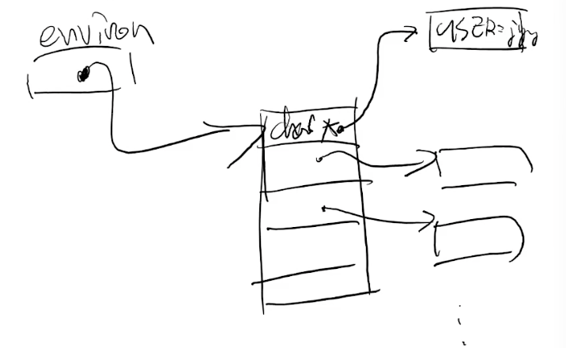
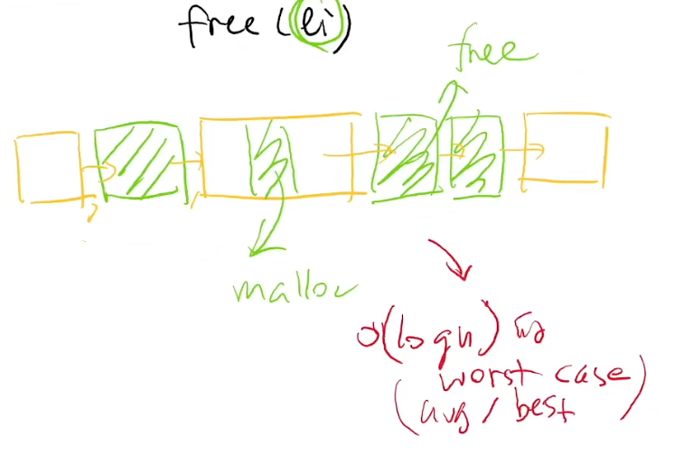
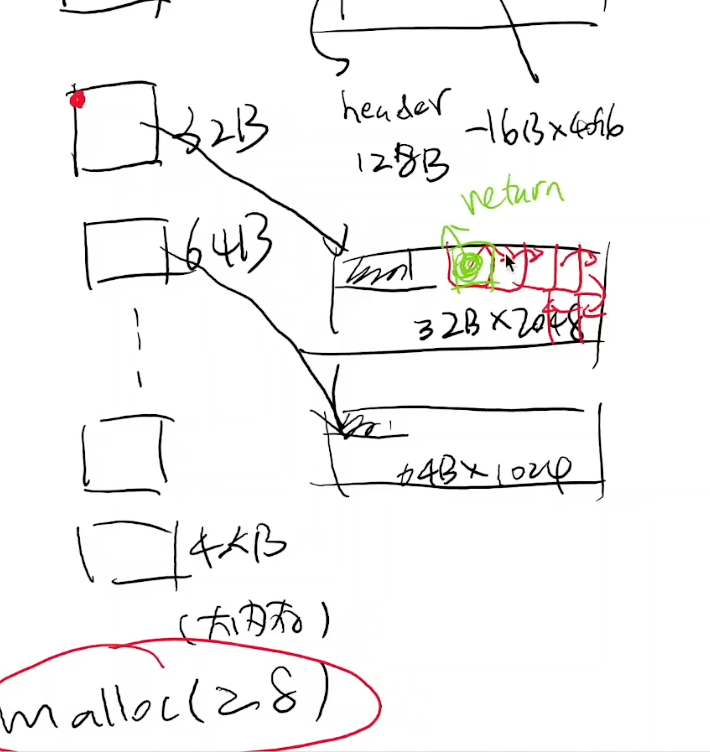
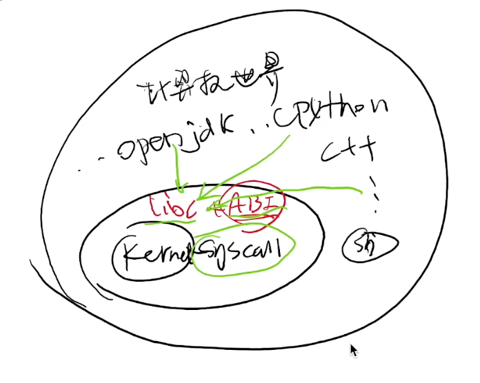

# C 标准库的实现

## Overview

复习

- [sh-xv6.c](http://jyywiki.cn/pages/OS/2022/demos/sh-xv6.c): 仅依赖系统调用的 “最小” 命令行 Shell

------

本次课回答的问题

- **Q**: 如何在系统调用之上构建程序能够普遍受惠的标准库？

------

本次课主要内容

- C 标准库设计与实现
- 基于 libc 的应用程序

## 一、熟悉又陌生的 libc

### 1、为什么需要 libc?

“裸奔” 编程：能用 (而且绝对够用)，但不好用

```c
long syscall(int num, ...) {
  va_list ap;
  va_start(ap, num);
  register long a0 asm ("rax") = num;
  register long a1 asm ("rdi") = va_arg(ap, long);
  register long a2 asm ("rsi") = va_arg(ap, long);
  register long a3 asm ("rdx") = va_arg(ap, long);
  register long a4 asm ("r10") = va_arg(ap, long);
  va_end(ap);
  asm volatile("syscall"
    : "+r"(a0) : "r"(a1), "r"(a2), "r"(a3), "r"(a4)
    : "memory", "rcx", "r8", "r9", "r11");
  return a0;
}
```

### 2、任何程序都用得上的定义

[Freestanding 环境](https://en.cppreference.com/w/cpp/freestanding)下也可以使用的定义

- [stddef.h](https://www.cplusplus.com/reference/cstddef/) - `size_t`
- [stdint.h](https://www.cplusplus.com/reference/cstdint/) - `int32_t`, `uint64_t`
- [stdbool.h](https://www.cplusplus.com/reference/cstdbool/) - `bool`, `true`, `false`
- [float.h](https://www.cplusplus.com/reference/cfloat/)
- [limits.h](https://www.cplusplus.com/reference/climits/)
- [stdarg.h](https://www.cplusplus.com/reference/cstdarg/)
    - syscall 就用到了 (但 syscall0, syscall1, ... 更高效)
- [inttypes.h](https://www.cplusplus.com/reference/cinttypes/)
    - 回答了你多年来的疑问！
    - 在你读过了小白阶段以后，就真的是 friendly manual 了

### 3、然后，系统调用也要用得方便！

> 系统调用是操作系统 “紧凑” 的最小接口。并不是所有系统调用都像 fork 一样可以直接使用。

低情商 API：

```c
#include <unistd.h>

int main() {
  extern char **environ;
  char *argv[] = { "echo", "hello", "world", NULL, };
  if (execve(argv[0], argv, environ) < 0) {
    perror("exec");
  }
}

// exec: No such file or directory
// execve 的第一个参数 argv[0] 必须是合法路径
// 换成 /bin/echo 就可以输出 hello world
```

高情商 API：

```c
execlp("echo", "echo", "hello", "world", NULL);
system("echo hello world");
```


```c
#include <unistd.h>
#include <stdlib.h>

int main() {
  execlp("echo", "echo", "hello", "world", NULL);
}
```

可以在环境变量中找到 echo

```bash
$ gcc a.c && ./a.out
hello world
$ strace ./a.out
...
execve("/usr/local/sbin/echo", ["echo", "hello", "world"], 0x7ffea91115d8 /* 22 vars */) = -1 ENOENT (No such file or directory)
execve("/usr/local/bin/echo", ["echo", "hello", "world"], 0x7ffea91115d8 /* 22 vars */) = -1 ENOENT (No such file or directory)
execve("/usr/sbin/echo", ["echo", "hello", "world"], 0x7ffea91115d8 /* 22 vars */) = -1 ENOENT (No such file or directory)
execve("/usr/bin/echo", ["echo", "hello", "world"], 0x7ffea91115d8 /* 22 vars */) = 0
...
write(1, "hello world\n", 12hello world
)           = 12
```


## 二、封装 (1): 纯粹的计算

### 1、[string.h](https://www.cplusplus.com/reference/cstring/): 字符串/数组操作

简单，不简单

```c
void *memset(void *s, int c, size_t n) {
  for (size_t i = 0; i < n; i++) {
    ((char *)s)[i] = c;
  }
  return s;
}
```

------

让我们看看 clang 把它编译成了什么…… 

- 以及，线程安全性？[memset-race.c](http://jyywiki.cn/pages/OS/2022/demos/memset-race.c)
- **标准库只对 “标准库内部数据” 的线程安全性负责**
    - 例子：printf 的 buffer

```c
#include "thread.h"

char buf[1 << 30];

void foo(int id) {
  memset(buf, '0' + id, sizeof(buf) - 1);
}

int main() {
  for (int i = 0; i < 4; i++)
    create(foo);
  join();
  puts(buf);
}

```


### 2、排序和查找

低情商 (低配置) API

```c
void qsort(void *base, size_t nmemb, size_t size,
           int (*compar)(const void *, const void *));

void *bsearch(const void *key, const void *base,
              size_t nmemb, size_t size,
              int (*compar)(const void *, const void *));
```

------

高情商 API

```c
sort(xs.begin(), xs.end(), [] (auto& a, auto& b) {...});
xs.sort(lambda key=...)
```

### 3、更多的例子

RTFM!

- 更多的 [stdlib.h](https://www.cplusplus.com/reference/cstdlib/) 中的例子
    - atoi, atol, atoll, strtoull, ...
    - rand (注意线程安全), ...
- [setjmp.h](https://www.cplusplus.com/reference/csetjmp/)
    - 体会到我们精心设计的良苦用心？
        - 一次掉队，终身掉队 😂
- [math.h](https://www.cplusplus.com/reference/cmath/)
    - 这玩意复杂了; 《操作系统》课直接摆烂
        - [Automatically improving accuracy for floating point expressions](https://dl.acm.org/doi/10.1145/2737924.2737959) (PLDI'15, Distinguished Paper 🏅)

## 三、封装 (2): 文件描述符

### 1、[stdio.h](https://www.cplusplus.com/reference/cstdio/): 你熟悉的味道

`FILE *` 背后其实是一个文件描述符

- 我们可以用 gdb 查看具体的`FILE *`(例如 `p *fp`, `p *stdin `, `p *stdout`)
    - 可以 “窥探” 到 glibc 的一些内部实现（这些参数 _fileno, _IO_buf_ptr, _IO_buf_end, _IO_buf_base）
    - 可以加载 glibc 的 debug symbols
        - 在这门课上不推荐：你调试起来会很浪费时间
- 封装了文件描述符上的系统调用 (fseek, fgetpos, ftell, feof, ...)

------

vprintf 系列

- 使用了 `stdarg.h` 的参数列表

```c
int vfprintf(FILE *stream, const char *format, va_list ap);
int vasprintf(char **ret, const char *format, va_list ap);
```

### 2、popen 和 pclose

我们在 [dosbox-hack.c](http://jyywiki.cn/pages/OS/2022/demos/dosbox-hack.c) 中使用了它

- 一个设计有缺陷的 API
    - Since a pipe is by definition unidirectional, the type argument may specify only reading or writing, *not both*; the resulting stream is correspondingly read-only or write-only.

------

高情商 API (现代编程语言)

```python
subprocess.check_output(['cat'],
  input=b'Hello World', stderr=subprocess.STDOUT)
```

```rust
let dir_checksum = {
  Exec::shell("find . -type f")
    | Exec::cmd("sort") | Exec::cmd("sha1sum")
}.capture()?.stdout_str();
```

## 四、封装 (3): 更多的进程/操作系统功能

### 1、err, error, perror

所有 API 都可能失败

```
$ gcc nonexist.c
gcc: error: nonexist.c: No such file or directory
```

------

这个 “No such file or directory” 似乎见得有点多？

- `cat nonexist.c, wc nonexist.c` 都是同样的 error message
- 这不是巧合！
    - 我们也可以 “山寨” 出同样的效果
    - `warn("%s", fname);`(观察 strace)
        - `err` 可以额外退出程序
- errno 是进程共享还是线程独享？
    - 这下知道协程的轻量了吧

### 2、environ (7)

我们也可以实现自己的 [env.c](http://jyywiki.cn/pages/OS/2022/demos/env.c)

- 问题来了：environ 是谁赋值的？
    - 这个函数又是在哪里定义的？

```c
#include <stdio.h>

int main() {
  extern char **environ;
  for (char **env = environ; *env; env++) {
    printf("%s\n", *env);
  }
}
```

**environ 解释图：



------

```bash
$ gcc -g -static a.c
$ ./a.out
// 一堆环境变量

$ gdb a.out
(gdb) starti
Starting program: /root/demo/a.out 

Program stopped.
0x00007ffff7fd0100 in ?? () from /lib64/ld-linux-x86-64.so.2
(gdb) p (char**)environ
$1 = (char **) 0x0
(gdb) wa (char**)environ
Watchpoint 1: (char**)environ
(gdb) c
Continuing.

Watchpoint 1: (char**)environ

Old value = (char **) 0x0
New value = (char **) 0x7fffffffe5a8
_init (argc=1, argv=<optimized out>, envp=<optimized out>)
    at init-first.c:77
77	init-first.c: No such file or directory.
```

RTFM 后

- 对环境变量的理解又上升了

## 五、封装 (4): 地址空间

### 1、malloc 和 free

Specification 很简单 (同 [Lab1](http://jyywiki.cn/OS/2022/Labs/L1))

- 在大区间 [L,R) 中维护互不相交的区间的集合

M={[ℓ0,r0),[ℓ1,r1),…,[ℓn,rn)}

- malloc(s) - 返回一段大小为s的区间
    - 必要时可以向操作系统申请额外的 [L,R) (观察 strace)
    - 允许在内存不足时 “拒绝” 请求
- free(ℓ,r) - 给定ℓ，删除[ℓ,r)∈M
    - 是否想起了《算法导论》？



------

多线程安全

- Scalability 就是个很大的问题了

### 2、实现高效的 malloc/free

> Premature optimization is the root of all evil.
>
> ——D. E. Knuth

重要的事情说三遍：

- **脱离 workload 做优化就是耍流氓**
- **脱离 workload 做优化就是耍流氓**
- **脱离 workload 做优化就是耍流氓**
    - 在开始考虑性能之前，理解你需要考虑什么样的性能

------

然后，去哪里找 workload?

- 当然是 paper 了 (顺便白得一个方案)
    - [Mimalloc: free list sharding in action](https://www.microsoft.com/en-us/research/uploads/prod/2019/06/mimalloc-tr-v1.pdf) (APLAS'19)

### 3、Workload 分析

> 指导思想：O(n) 大小的对象分配后至少有 Ω(n) 的读写操作，否则就是 performance bug (不应该分配那么多)。

- 越小的对象创建/分配越频繁
    - 字符串、临时对象等 (几十到几百字节)；生存周期可长可短 
- 较为频繁地分配中等大小的对象
    - 较大的数组、复杂的对象；更长的生存周期
- 低频率的大对象
    - 巨大的容器、分配器；很长的生存周期
- **并行、并行、再并行**
    - 所有分配都会在所有处理器上发生
    - 使用链表/区间树 (first fit) 可不是个好想法

### 4、`malloc`, Fast and Slow

设置两套系统：

- fast path
    - 性能极好、并行度极高、覆盖大部分情况
    - 但有小概率会失败 (fall back to slow path)
- slow path
    - 不在乎那么快
    - 但把困难的事情做好
        - 计算机系统里有很多这样的例子 (比如 cache)

------

人类也是这样的系统

- Daniel Kahneman. *Thinking, Fast and Slow*. Farrar, Straus and Giroux, 2011.

### 5、`malloc`: Fast Path 设计

**使所有 CPU 都能并行地申请内存**

- 线程都事先瓜分一些 “领地” (thread-local allocation buffer)
- 默认从自己的领地里分配
    - 除了在另一个 CPU 释放，acquire lock 几乎总是成功
- 如果自己的领地不足，就从全局的池子里借一点



------

不要在乎一点小的浪费

- 这就是为什么要对齐到 2^k 字节

### 6、小内存：Segregated List

分配: Segregated List (Slab)

- 每个 slab 里的每个对象都一样大
    - 每个线程拥有每个对象大小的 slab
    - fast path → 立即在线程本地分配完成
    - slow path → pgalloc()
- 两种实现
    - 全局大链表 v.s. List sharding (per-page 小链表)

回收

- 直接归还到 slab 中
    - 注意这可能是另一个线程持有的 slab，需要 per-slab 锁 (小心数据竞争)

### 7、大内存：一把大锁保平安

Buddy system (1963)

- 如果你想分配 1, 2, 3, 4, ... n 个连续的页面？
    - 例如：64 KB/页面
- 那就 first fit 或者 best fit 吧……

------

你只需要一个数据结构解决问题

- 区间树；线段树……

### 8、现实世界中的 malloc/free

以上就是所有现代 malloc/free 实现的基础

- 当然，实际情况会复杂一些，性能也是锱铢必较
    - [glibc](https://sourceware.org/glibc/wiki/MallocInternals): arena → heap → tcache (thread-local)
    - [tcmalloc](https://google.github.io/tcmalloc/design.html): thread-caching malloc, [mimalloc](https://github.com/microsoft/mimalloc)
    - [OpenJDK: ZGC](https://wiki.openjdk.java.net/display/zgc/Main): region based + tlab (thread-local)
        - managed memory 允许 object move，因此复杂得多......

## 六、无止境地封装

### 1、想知道有没有更多的功能？

RTFM: [The GNU C Library](https://www.gnu.org/software/libc/manual/), RTFSC: [Newlib](https://sourceware.org/newlib/)

- 都不太长 (glibc 的手册和 newlib 的源码) 也好读
- Computer System 系列课程的重要目标：摆正看手册的心态

------

你会发现很多宝藏

- Globbing
- Regex
- Shell-style word expansion
- ……

### 2、我们还可以……

走出 C 的领域，基于 libc 实现

- C++ 编译器
    - 继续实现 C++ Standard Library
    - 继续实现 [OpenJDK (HotSpot)](https://openjdk.java.net/groups/hotspot/)
    - 继续实现 [V8](https://v8.dev/) (JavaScript)
- CPython
- Go
    - 再之后 Go 就可以自己编译自己了 (Goodbye, C!)

------

Eventually, (千疮百孔) 的整个计算机世界！

- [C is not a low-level language](https://dl.acm.org/doi/pdf/10.1145/3209212) (CACM'18)
- [C isn't a programming language any more](https://gankra.github.io/blah/c-isnt-a-language/) (Gankra's Blog)

## 总结

本次课回答的问题

- **Q**: 如何在系统调用之上构建程序能够普遍受惠的标准库？



------

Take-away messages

- libc
    - RTFM; RTFSC: 充满了宝藏
    - 性能优化中的 fast/slow path
- 然后，你拥有了整个世界！

