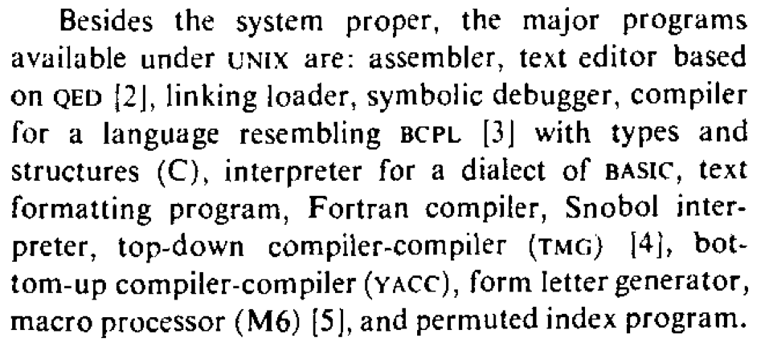
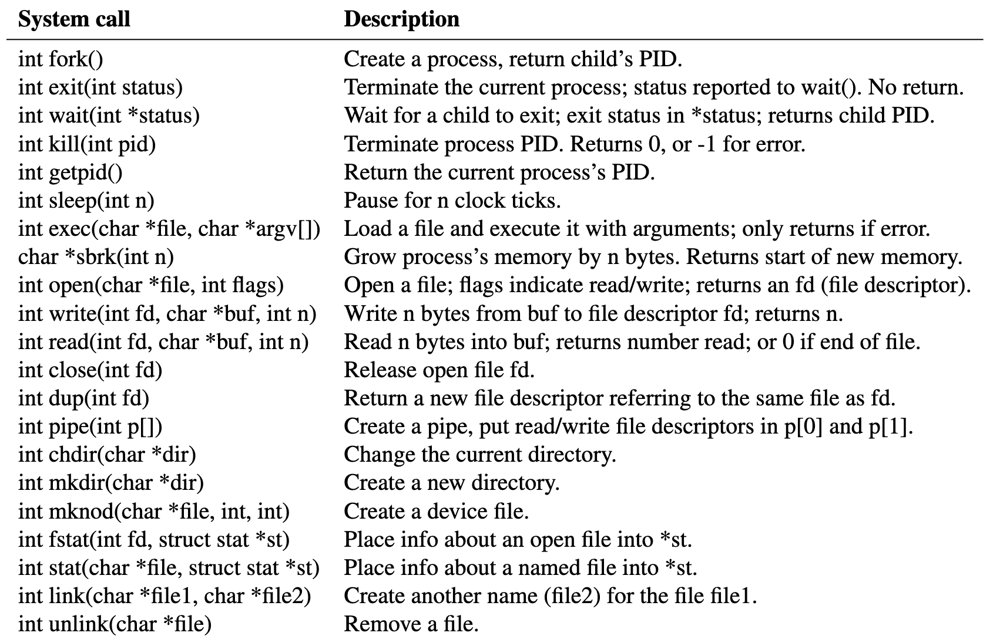
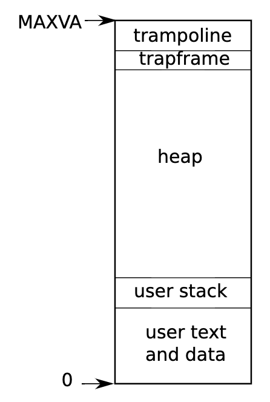

# xv6 代码导读

## Overview

复习

- 应用视角的操作系统：对象 + API
    - 把操作系统当提供服务的 “黑盒子” 

------

本次课回答的问题

- **Q**: 如何理解 “操作系统就是 C 程序”？

------

本次课主要内容

- xv6 简介
- xv6 代码导读

## 一、xv6 简介

### 1、UNIX 传奇

一万行代码得到一个真正的、好用的操作系统

- [The UNIX time sharing system](https://dl.acm.org/doi/10.1145/357980.358014) (SOSP'73 and CACM'74)
- 免费授权给高校使用，它实在太适合教学了！
    - [UNIX v6 book](http://jyywiki.cn/pages/OS/manuals/unix-v6-book.pdf)



### 2、xv6 系统调用 API

21 个系统调用 (参考 [sh-xv6.c](http://jyywiki.cn/pages/OS/2022/demos/sh-xv6.c) 使用的系统调用)



### 3、xv6: UNIX v6 的现代 “克隆”

接近完整的 UNIX Shell 体验

- 基本工具集 (wc, echo, cat, ...)
- 命令执行、管道、重定向
    - 支持多处理器
    - Now in RISC-V!

它真的是一个 “可用” 的操作系统！

- 时间回到 1970s
- 这些系统调用就足够支撑刚才提到的应用
    - cc, as, ld, vi, sed, awk, troff, lp, ...

### 4、xv6 系统实现

这是一份包含了很多 Good Practice 的代码

- 对初学者来说更像是一个 “艺术品”
- 从代码里吸取智慧
- 注释的方式，命名的方式等等

------

RTFM

- [xv6: A simple, Unix-like teaching operating system](http://jyywiki.cn/pages/OS/manuals/xv6-riscv-rev2.pdf)
- 宝藏手册，包含了所有细节和 “为什么要这么做”，推荐阅读

------

RTFSC

- [xv6-riscv](https://github.com/mit-pdos/xv6-riscv)
- 会分几次课讲解

**jyy 大佬在学习 linux 代码的时候也会看不懂，但是他会联想 linux 下的代码对应到 xv6 上是哪里，他就明白了**

### 5、项目构建与运行

RTFSC: Makefile

- 相比 AbstractMachine (跨平台/体系结构) 容易很多
- 先找到构建目标
    - 然后老规矩: `make -nB`
    - 你可以根据需要修改一些配置
        - 优化等级、CPU 数、编译指令等

------

复习：“程序的执行 (状态变化序列) 有时比代码 (状态机) 更容易理解”

- 可以用于配制 vscode
    - Quick quiz: 如何自动生成 `compile_commands.json`?

```bash
$ bear make qemu
```

所有的 vscode 中编译错误（所有的红线）就消失了

**正确的工具太重要了，好的工具会促使人愿意去读代码，帮助人克服惰性**

## 二、xv6 中的进程

### 1、xv6 进程的地址空间

回顾：进程 = 运行的状态机 (user/)

- gcc/ld 创建：代码、数据
    - 参考 ldscript
- 运行时分配：堆栈
    - 包含 exec 的参数
- 例子：`init.c` 和 `sh.c` ([sh-xv6.c](http://jyywiki.cn/pages/OS/2022/demos/sh-xv6.c) 的真身)

------

MAXVA 处有两个神奇的页面

- Trampoline 和 trapframe
    - 由操作系统分配，用户进程无权访问



### 2、调试用户代码

试一试 init 进程

- `proc.c` 中包含一段 initcode
  - 我们可以调试它！(`b *0`)
  - 系统调用实现：编号放入 a7 寄存器，执行 ecall 指令
    - man 2 syscall
- 然后再调试 `_init`
  - `add-symbol-file user/_init` 加载调试信息

------

使用 QEMU

- 查看地址空间 `info mem`
- 对照手册，查看寄存器，例如 `p/x $stvec`
  - 可以打上断点 (`b *$stvec`)

【1:10:40】开始教大家调试

make qemu-gdb 

## 三、xv6 系统调用

### 1、xv6 系统调用

RISC-V user-level ecall 指令

- 关闭中断
- 复制 $pc 到 $sepc
- 设置 $sstatus 为 S-mode
- 设置 $scause 为 trap 的原因 (ecall, 8)
- 跳转到 $stvec ($pc = $stvec)

------

在 xv6 中

- Trampoline: $stvec = 0x3ffffff000 (只读)
- Trapframe (0x3fffffe000): 保存进程寄存器现场的内存

### 2、Trampoline (跳板)

trampoline.S (汇编代码)

- 对 ecall 瞬间的状态做快照
  - **填充 `struct trapframe` (proc.h)**
  - 利用 $sscratch (S-mode scratch) 保存所有寄存器
  - 切换到内核栈 (相当于切换到进程对应的 “内核线程”, [L2](http://jyywiki.cn/OS/2022/labs/L2))
  - 切换到内核地址空间
    - 修改 $satp (S-mode address translation and protection)
    - sfence.vma
  - 跳转到 `tf->kernel_trap`
    - 痛苦时间解除，进入 C 代码

### 3、系统调用处理

`struct proc *p = myproc()`

- 我们可以在 gdb 中查看 “进程” 在操作系统内的数据结构表示
  - `p/x *p`
    - 可以看到 trapframe 的地址 (和地址空间中映射的完全一样)
  - `p/x *p->trapframe` (a7 = 0x7)
- 检查 `scause == 8` (syscall)
  - $epc += 4 (更正返回地址)
  - 打开中断
  - 执行系统调用
- `usertrapret()` 返回
  - ecall 的逆操作

## 总结

本次课回答的问题

- **Q**: 如何理解 “操作系统就是 C 程序”？

------

Take-away messages

- Talk is cheap. Show me the code.
- [RTFM](http://jyywiki.cn/pages/OS/manuals/xv6-riscv-rev2.pdf), [RTFSC](https://github.com/mit-pdos/xv6-riscv)
- 用好现代工具
  - gdb tui + python, vscode, ...